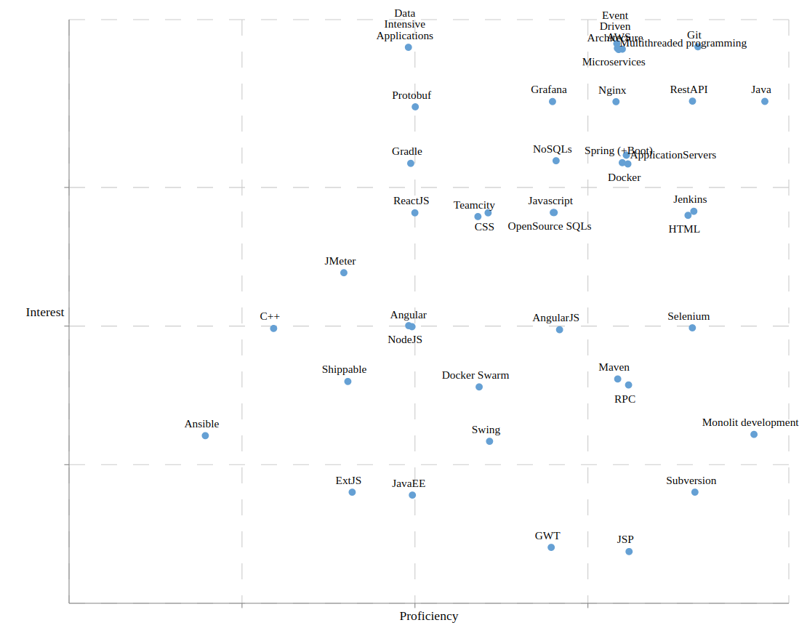

Dynamic representation of the skills matrix via scatter chart using http://recharts.org/en-US library for React.

Call `ǹpm start` to view the chart.

Adjust file `data.json` to change positions of the dots on the chart.

Example representation:

